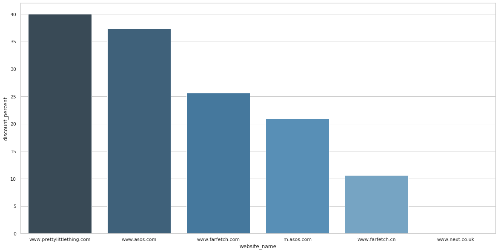

## Description

* Dataset of products from different online fashion retailers
* Below are tasks performed on this data:
    1. Handling null values.
    2. Discard records with invalid IDs.
    3. Feature extraction from columns 'price', 'brand' and 'media'.
    4. Data pre-processing on new features.
    5. Removing product with offer price greater than regular price.
    6. Check on outliers and dropping them.
    7. Removing records with invalid URLs.
    8. Data visualization.
    9. NLP on product description.
    10. Unsupervised clustering.

### Importing required libraries


```python
import numpy as np
import pandas as pd
from pandas.io.json import json_normalize

import matplotlib.pyplot as plt
import seaborn as sns

import urllib
from urllib.parse import urlparse

import nltk
nltk.download('punkt')
nltk.download('stopwords')
nltk.download('wordnet')
from nltk.tokenize import word_tokenize
from nltk.corpus import stopwords
from nltk.stem import WordNetLemmatizer

from wordcloud import WordCloud
from IPython.display import Image
from IPython.core.display import HTML

from sklearn import preprocessing
from sklearn.cluster import DBSCAN
```

    [nltk_data] Downloading package punkt to /root/nltk_data...
    [nltk_data]   Package punkt is already up-to-date!
    [nltk_data] Downloading package stopwords to /root/nltk_data...
    [nltk_data]   Package stopwords is already up-to-date!
    [nltk_data] Downloading package wordnet to /root/nltk_data...
    [nltk_data]   Package wordnet is already up-to-date!


### Mount google drive


```python
from google.colab import drive
drive.mount('/content/gdrive')
path = '/content/gdrive/My Drive/'
```

    Drive already mounted at /content/gdrive; to attempt to forcibly remount, call drive.mount("/content/gdrive", force_remount=True).


### Importing data


```python
data = pd.read_csv(path+'data_engineering_assignment.txt', sep='|', error_bad_lines=False, warn_bad_lines=False)
data.head()
```

    /usr/local/lib/python3.6/dist-packages/IPython/core/interactiveshell.py:2718: DtypeWarning: Columns (4) have mixed types. Specify dtype option on import or set low_memory=False.
      interactivity=interactivity, compiler=compiler, result=result)


<div>
<style scoped>
    .dataframe tbody tr th:only-of-type {
        vertical-align: middle;
    }

    .dataframe tbody tr th {
        vertical-align: top;
    }

    .dataframe thead th {
        text-align: right;
    }
</style>
<table border="1" class="dataframe">
  <thead>
    <tr style="text-align: right;">
      <th></th>
      <th>_id</th>
      <th>name</th>
      <th>price</th>
      <th>website_id</th>
      <th>sku</th>
      <th>url</th>
      <th>brand</th>
      <th>media</th>
      <th>description_text</th>
    </tr>
  </thead>
  <tbody>
    <tr>
      <th>0</th>
      <td>5d0b8aca0db7220b86cb4035</td>
      <td>Joules Top Dog Underwear Three Pack</td>
      <td>{'offer_price': {'currency': 'GBP', 'value': 3...</td>
      <td>5cff5e7fe40f4900046735fa</td>
      <td>312838</td>
      <td>www.next.co.uk/style/st355408#312838</td>
      <td>{'name': 'joules', 'sub_brand': ''}</td>
      <td>{'standard': [{'order': 1, 'url': 'https://xcd...</td>
      <td>95% Cotton, 5% Elastane.</td>
    </tr>
    <tr>
      <th>1</th>
      <td>5d0b8aca0db7220b86cb4036</td>
      <td>Figleaves Cheetah Satin Pyjama Set</td>
      <td>{'offer_price': {'currency': 'GBP', 'value': 2...</td>
      <td>5cff5e7fe40f4900046735fa</td>
      <td>319571</td>
      <td>https://www.next.co.uk/style/st324987#319571</td>
      <td>{'name': 'figleaves', 'sub_brand': ''}</td>
      <td>{'standard': [{'order': 1, 'url': 'https://xcd...</td>
      <td>100% Polyester.</td>
    </tr>
    <tr>
      <th>2</th>
      <td>5d0b8aca0db7220b86cb4037</td>
      <td>Nike Solid 4" Swim Short</td>
      <td>{'offer_price': {'currency': 'GBP', 'value': 1...</td>
      <td>5cff5e7fe40f4900046735fa</td>
      <td>335026</td>
      <td>https://www.next.co.uk/style/st400645#335026</td>
      <td>{'name': 'nike', 'sub_brand': ''}</td>
      <td>{'standard': [{'order': 1, 'url': 'https://xcd...</td>
      <td>Nike Swim Boys' Solid Lap 4 Volley Short is a ...</td>
    </tr>
    <tr>
      <th>3</th>
      <td>5d0b8aca0db7220b86cb4038</td>
      <td>Collection Luxe Orchid</td>
      <td>{'offer_price': {'currency': 'GBP', 'value': 1...</td>
      <td>5cff5e7fe40f4900046735fa</td>
      <td>552266</td>
      <td>https://www.next.co.uk/style/st262195#552266</td>
      <td>{'name': 'next', 'sub_brand': ''}</td>
      <td>{'standard': [{'order': 1, 'url': 'https://xcd...</td>
      <td>Height 85cm</td>
    </tr>
    <tr>
      <th>4</th>
      <td>5d0b8aca0db7220b86cb4039</td>
      <td>River Island White Sleeveless Blazer</td>
      <td>{'offer_price': {'currency': 'GBP', 'value': 5...</td>
      <td>5cff5e7fe40f4900046735fa</td>
      <td>680971</td>
      <td>https://www.next.co.uk/style/st440132#680971</td>
      <td>{'name': 'river island', 'sub_brand': ''}</td>
      <td>{'standard': [{'order': 1, 'url': 'https://xcd...</td>
      <td>100% Polyester.</td>
    </tr>
  </tbody>
</table>
</div>


### Check for Null Values


```python
data.isna().sum()
```


    _id                    0
    name                5163
    price               5163
    website_id          5163
    sku                 5576
    url                 5163
    brand               5163
    media               5163
    description_text    5631
    dtype: int64


#### Invalid IDs values and all missing values for other features of it


```python
data[data.website_id.isna()].head()
```


<div>
<style scoped>
    .dataframe tbody tr th:only-of-type {
        vertical-align: middle;
    }

    .dataframe tbody tr th {
        vertical-align: top;
    }

    .dataframe thead th {
        text-align: right;
    }
</style>
<table border="1" class="dataframe">
  <thead>
    <tr style="text-align: right;">
      <th></th>
      <th>_id</th>
      <th>name</th>
      <th>price</th>
      <th>website_id</th>
      <th>sku</th>
      <th>url</th>
      <th>brand</th>
      <th>media</th>
      <th>description_text</th>
    </tr>
  </thead>
  <tbody>
    <tr>
      <th>16</th>
      <td>Canvas upper with TOMS toe-stitch, and elastic...</td>
      <td>NaN</td>
      <td>NaN</td>
      <td>NaN</td>
      <td>NaN</td>
      <td>NaN</td>
      <td>NaN</td>
      <td>NaN</td>
      <td>NaN</td>
    </tr>
    <tr>
      <th>17</th>
      <td>TOMS classic suede insole with cushion for com...</td>
      <td>NaN</td>
      <td>NaN</td>
      <td>NaN</td>
      <td>NaN</td>
      <td>NaN</td>
      <td>NaN</td>
      <td>NaN</td>
      <td>NaN</td>
    </tr>
    <tr>
      <th>18</th>
      <td>Latex arch insert for added support</td>
      <td>NaN</td>
      <td>NaN</td>
      <td>NaN</td>
      <td>NaN</td>
      <td>NaN</td>
      <td>NaN</td>
      <td>NaN</td>
      <td>NaN</td>
    </tr>
    <tr>
      <th>19</th>
      <td>One-piece outsole for flexibility and durability</td>
      <td>NaN</td>
      <td>NaN</td>
      <td>NaN</td>
      <td>NaN</td>
      <td>NaN</td>
      <td>NaN</td>
      <td>NaN</td>
      <td>NaN</td>
    </tr>
    <tr>
      <th>20</th>
      <td>With every pair of shoes you purchase, TOMS wi...</td>
      <td>NaN</td>
      <td>NaN</td>
      <td>NaN</td>
      <td>NaN</td>
      <td>NaN</td>
      <td>NaN</td>
      <td>NaN</td>
      <td>NaN</td>
    </tr>
  </tbody>
</table>
</div>


* Dropping rows with invalid IDs


```python
data.drop(data[data.website_id.isna()].index, axis=0, inplace=True)
data = data.reset_index()
data.drop('index', axis=1, inplace=True)
data.isna().sum()
```


    _id                   0
    name                  0
    price                 0
    website_id            0
    sku                 413
    url                   0
    brand                 0
    media                 0
    description_text    468
    dtype: int64


#### Null values for SKU codes and Product description
* Still we see few null values for SKU Codes and Product description.
* We can replace them with value 'No SKU Code' and 'No description' and retain other feature for products for analysis


```python
data.loc[data.sku.isna(), 'sku'] = 'No SKU Code'
data.loc[data.description_text.isna(), 'description_text'] = 'No description'
data.isna().sum()
```


    _id                 0
    name                0
    price               0
    website_id          0
    sku                 0
    url                 0
    brand               0
    media               0
    description_text    0
    dtype: int64


* A glance at shape of data we have


```python
print('Rows :', data.shape[0], 'Columns :', data.shape[1])
```

    Rows : 318278 Columns : 9


### Feature extraction from column 'price', 'brand', and 'media'
* Data in this column are in JSON Objects
* So, we can extract those key-values pairs and add them to features.

#### Extracting from column 'price'


```python
data['price'] = data['price'].apply(lambda x : eval(x))
price_data = json_normalize(data['price'])
data.drop('price', axis=1, inplace=True)
price_data.head()
```


<div>
<style scoped>
    .dataframe tbody tr th:only-of-type {
        vertical-align: middle;
    }

    .dataframe tbody tr th {
        vertical-align: top;
    }

    .dataframe thead th {
        text-align: right;
    }
</style>
<table border="1" class="dataframe">
  <thead>
    <tr style="text-align: right;">
      <th></th>
      <th>offer_price.currency</th>
      <th>offer_price.value</th>
      <th>regular_price.currency</th>
      <th>regular_price.value</th>
      <th>basket_price.value</th>
      <th>basket_price.currency</th>
    </tr>
  </thead>
  <tbody>
    <tr>
      <th>0</th>
      <td>GBP</td>
      <td>35.0</td>
      <td>GBP</td>
      <td>35.0</td>
      <td>NaN</td>
      <td>NaN</td>
    </tr>
    <tr>
      <th>1</th>
      <td>GBP</td>
      <td>25.0</td>
      <td>GBP</td>
      <td>25.0</td>
      <td>NaN</td>
      <td>NaN</td>
    </tr>
    <tr>
      <th>2</th>
      <td>GBP</td>
      <td>15.0</td>
      <td>GBP</td>
      <td>15.0</td>
      <td>NaN</td>
      <td>NaN</td>
    </tr>
    <tr>
      <th>3</th>
      <td>GBP</td>
      <td>150.0</td>
      <td>GBP</td>
      <td>150.0</td>
      <td>NaN</td>
      <td>NaN</td>
    </tr>
    <tr>
      <th>4</th>
      <td>GBP</td>
      <td>55.0</td>
      <td>GBP</td>
      <td>55.0</td>
      <td>NaN</td>
      <td>NaN</td>
    </tr>
  </tbody>
</table>
</div>


```python
price_data['offer_price.currency'].unique()
```


    array(['GBP'], dtype=object)


* Either Currency is GBP or NaN so dropping currency columns from price_data


```python
drop = ['offer_price.currency', 'regular_price.currency', 'basket_price.currency']
for col in drop:
  price_data.drop(col, axis=1, inplace=True)
price_data.head()
```


<div>
<style scoped>
    .dataframe tbody tr th:only-of-type {
        vertical-align: middle;
    }

    .dataframe tbody tr th {
        vertical-align: top;
    }

    .dataframe thead th {
        text-align: right;
    }
</style>
<table border="1" class="dataframe">
  <thead>
    <tr style="text-align: right;">
      <th></th>
      <th>offer_price.value</th>
      <th>regular_price.value</th>
      <th>basket_price.value</th>
    </tr>
  </thead>
  <tbody>
    <tr>
      <th>0</th>
      <td>35.0</td>
      <td>35.0</td>
      <td>NaN</td>
    </tr>
    <tr>
      <th>1</th>
      <td>25.0</td>
      <td>25.0</td>
      <td>NaN</td>
    </tr>
    <tr>
      <th>2</th>
      <td>15.0</td>
      <td>15.0</td>
      <td>NaN</td>
    </tr>
    <tr>
      <th>3</th>
      <td>150.0</td>
      <td>150.0</td>
      <td>NaN</td>
    </tr>
    <tr>
      <th>4</th>
      <td>55.0</td>
      <td>55.0</td>
      <td>NaN</td>
    </tr>
  </tbody>
</table>
</div>


#### Extracting from column 'brand'


```python
data['brand'] = data['brand'].apply(lambda x : eval(x))
brand_data = json_normalize(data['brand'])
data.drop('brand', axis=1, inplace=True)
brand_data.head()
```


<div>
<style scoped>
    .dataframe tbody tr th:only-of-type {
        vertical-align: middle;
    }

    .dataframe tbody tr th {
        vertical-align: top;
    }

    .dataframe thead th {
        text-align: right;
    }
</style>
<table border="1" class="dataframe">
  <thead>
    <tr style="text-align: right;">
      <th></th>
      <th>name</th>
      <th>sub_brand</th>
    </tr>
  </thead>
  <tbody>
    <tr>
      <th>0</th>
      <td>joules</td>
      <td></td>
    </tr>
    <tr>
      <th>1</th>
      <td>figleaves</td>
      <td></td>
    </tr>
    <tr>
      <th>2</th>
      <td>nike</td>
      <td></td>
    </tr>
    <tr>
      <th>3</th>
      <td>next</td>
      <td></td>
    </tr>
    <tr>
      <th>4</th>
      <td>river island</td>
      <td></td>
    </tr>
  </tbody>
</table>
</div>


* We got some missing values in form of empty strings
* Replacing them with 'No brand name' for name and 'No sub-brand name' for sub_brand


```python
brand_data.loc[brand_data.name.values == '', 'name'] = 'No brand name'
brand_data.loc[brand_data.sub_brand.values == '', 'sub_brand'] = 'No sub-brand name'
brand_data.head()
```


<div>
<style scoped>
    .dataframe tbody tr th:only-of-type {
        vertical-align: middle;
    }

    .dataframe tbody tr th {
        vertical-align: top;
    }

    .dataframe thead th {
        text-align: right;
    }
</style>
<table border="1" class="dataframe">
  <thead>
    <tr style="text-align: right;">
      <th></th>
      <th>name</th>
      <th>sub_brand</th>
    </tr>
  </thead>
  <tbody>
    <tr>
      <th>0</th>
      <td>joules</td>
      <td>No sub-brand name</td>
    </tr>
    <tr>
      <th>1</th>
      <td>figleaves</td>
      <td>No sub-brand name</td>
    </tr>
    <tr>
      <th>2</th>
      <td>nike</td>
      <td>No sub-brand name</td>
    </tr>
    <tr>
      <th>3</th>
      <td>next</td>
      <td>No sub-brand name</td>
    </tr>
    <tr>
      <th>4</th>
      <td>river island</td>
      <td>No sub-brand name</td>
    </tr>
  </tbody>
</table>
</div>


* We already got a column with 'name' for product name
* So renaming brand columns with 'brand_name', 'sub_brand_name'


```python
brand_data.columns = ['brand_name', 'sub_brand_name']
```

#### Extracting from column 'media'
* This contains three keys standard, thumbnail and large.
* Extracting URL values for those and creating columns in data for it


```python
data['media'] = data['media'].apply(lambda x : eval(x))
standard_url = []
thumbnail_url = []
large_url = []
for val in data['media']:
  try:
      standard_url.append(val['standard'][0]['url'])
  except IndexError:
      standard_url.append('No media URL')

  try:
      thumbnail_url.append(val['thumbnail'][0]['url'])
  except (IndexError, KeyError):
      thumbnail_url.append('No media URL')

  try:
      large_url.append(val['large'][0]['url'])
  except (IndexError, KeyError):
      large_url.append('No media URL')

data['standard_media_url'] = standard_url
data['thumbnail_media_url'] = thumbnail_url
data['large_media_url'] = large_url

data.drop('media', axis=1, inplace=True)
```

* Again a check on shape before concatenating them with original data 


```python
data.shape, price_data.shape, brand_data.shape
```


    ((318278, 9), (318278, 3), (318278, 2))


#### Concatenating all feature obtained with original data
* Also a quick glance on our data with new feature


```python
data = pd.concat([data, price_data, brand_data], axis=1)
data.head()
```


<div>
<style scoped>
    .dataframe tbody tr th:only-of-type {
        vertical-align: middle;
    }

    .dataframe tbody tr th {
        vertical-align: top;
    }

    .dataframe thead th {
        text-align: right;
    }
</style>
<table border="1" class="dataframe">
  <thead>
    <tr style="text-align: right;">
      <th></th>
      <th>_id</th>
      <th>name</th>
      <th>website_id</th>
      <th>sku</th>
      <th>url</th>
      <th>description_text</th>
      <th>standard_media_url</th>
      <th>thumbnail_media_url</th>
      <th>large_media_url</th>
      <th>offer_price.value</th>
      <th>regular_price.value</th>
      <th>basket_price.value</th>
      <th>brand_name</th>
      <th>sub_brand_name</th>
    </tr>
  </thead>
  <tbody>
    <tr>
      <th>0</th>
      <td>5d0b8aca0db7220b86cb4035</td>
      <td>Joules Top Dog Underwear Three Pack</td>
      <td>5cff5e7fe40f4900046735fa</td>
      <td>312838</td>
      <td>www.next.co.uk/style/st355408#312838</td>
      <td>95% Cotton, 5% Elastane.</td>
      <td>https://xcdn.next.co.uk/Common/Items/Default/D...</td>
      <td>No media URL</td>
      <td>No media URL</td>
      <td>35.0</td>
      <td>35.0</td>
      <td>NaN</td>
      <td>joules</td>
      <td>No sub-brand name</td>
    </tr>
    <tr>
      <th>1</th>
      <td>5d0b8aca0db7220b86cb4036</td>
      <td>Figleaves Cheetah Satin Pyjama Set</td>
      <td>5cff5e7fe40f4900046735fa</td>
      <td>319571</td>
      <td>https://www.next.co.uk/style/st324987#319571</td>
      <td>100% Polyester.</td>
      <td>https://xcdn.next.co.uk/Common/Items/Default/D...</td>
      <td>No media URL</td>
      <td>No media URL</td>
      <td>25.0</td>
      <td>25.0</td>
      <td>NaN</td>
      <td>figleaves</td>
      <td>No sub-brand name</td>
    </tr>
    <tr>
      <th>2</th>
      <td>5d0b8aca0db7220b86cb4037</td>
      <td>Nike Solid 4" Swim Short</td>
      <td>5cff5e7fe40f4900046735fa</td>
      <td>335026</td>
      <td>https://www.next.co.uk/style/st400645#335026</td>
      <td>Nike Swim Boys' Solid Lap 4 Volley Short is a ...</td>
      <td>https://xcdn.next.co.uk/Common/Items/Default/D...</td>
      <td>No media URL</td>
      <td>No media URL</td>
      <td>15.0</td>
      <td>15.0</td>
      <td>NaN</td>
      <td>nike</td>
      <td>No sub-brand name</td>
    </tr>
    <tr>
      <th>3</th>
      <td>5d0b8aca0db7220b86cb4038</td>
      <td>Collection Luxe Orchid</td>
      <td>5cff5e7fe40f4900046735fa</td>
      <td>552266</td>
      <td>https://www.next.co.uk/style/st262195#552266</td>
      <td>Height 85cm</td>
      <td>https://xcdn.next.co.uk/Common/Items/Default/D...</td>
      <td>No media URL</td>
      <td>No media URL</td>
      <td>150.0</td>
      <td>150.0</td>
      <td>NaN</td>
      <td>next</td>
      <td>No sub-brand name</td>
    </tr>
    <tr>
      <th>4</th>
      <td>5d0b8aca0db7220b86cb4039</td>
      <td>River Island White Sleeveless Blazer</td>
      <td>5cff5e7fe40f4900046735fa</td>
      <td>680971</td>
      <td>https://www.next.co.uk/style/st440132#680971</td>
      <td>100% Polyester.</td>
      <td>https://xcdn.next.co.uk/Common/Items/Default/D...</td>
      <td>No media URL</td>
      <td>No media URL</td>
      <td>55.0</td>
      <td>55.0</td>
      <td>NaN</td>
      <td>river island</td>
      <td>No sub-brand name</td>
    </tr>
  </tbody>
</table>
</div>


### Data description
* '_id' : Product IDs
* 'name' : Product Names
* 'website_id' : IDs for company websites
* 'sku' : SKU codes for particular products
* 'url' : URLs for product listed on websites
* 'description_text' : Product descriptions
* 'media': URLs for Standard , Large and Thumbnails media
* 'price': Product price in GBP (Offer and Regular prices)
* 'brand': Brand name of product

### Data pre-processing on newly obtained data

#### Again null values check with new columns, checking with percentage


```python
data.isna().sum()/data.shape[0] * 100
```


    _id                     0.000000
    name                    0.000000
    website_id              0.000000
    sku                     0.000000
    url                     0.000000
    description_text        0.000000
    standard_media_url      0.000000
    thumbnail_media_url     0.000000
    large_media_url         0.000000
    offer_price.value       0.104311
    regular_price.value     0.104311
    basket_price.value     65.510340
    brand_name              0.000000
    sub_brand_name          0.000000
    dtype: float64


* 65.51% of 'basket_price.value' are null values, hence we can drop it.


```python
data.drop('basket_price.value', axis=1, inplace=True)
```

* Also 'offer_price.value' and 'regular_price.value' are just 0.10% null. So, we can drop that paticular rows.


```python
data.drop(data[data['regular_price.value'].isna()].index, axis=0, inplace=True)
data = data.reset_index()
data.drop('index', axis=1, inplace=True)
data.isna().sum()
```


    _id                    0
    name                   0
    website_id             0
    sku                    0
    url                    0
    description_text       0
    standard_media_url     0
    thumbnail_media_url    0
    large_media_url        0
    offer_price.value      0
    regular_price.value    0
    brand_name             0
    sub_brand_name         0
    dtype: int64


#### Quick check on stats


```python
data.describe(include='all')
```


<div>
<style scoped>
    .dataframe tbody tr th:only-of-type {
        vertical-align: middle;
    }

    .dataframe tbody tr th {
        vertical-align: top;
    }

    .dataframe thead th {
        text-align: right;
    }
</style>
<table border="1" class="dataframe">
  <thead>
    <tr style="text-align: right;">
      <th></th>
      <th>_id</th>
      <th>name</th>
      <th>website_id</th>
      <th>sku</th>
      <th>url</th>
      <th>description_text</th>
      <th>standard_media_url</th>
      <th>thumbnail_media_url</th>
      <th>large_media_url</th>
      <th>offer_price.value</th>
      <th>regular_price.value</th>
      <th>brand_name</th>
      <th>sub_brand_name</th>
    </tr>
  </thead>
  <tbody>
    <tr>
      <th>count</th>
      <td>317946</td>
      <td>317946</td>
      <td>317946</td>
      <td>317946</td>
      <td>317946</td>
      <td>317946</td>
      <td>317946</td>
      <td>317946</td>
      <td>317946</td>
      <td>3.179460e+05</td>
      <td>3.179460e+05</td>
      <td>317946</td>
      <td>317946</td>
    </tr>
    <tr>
      <th>unique</th>
      <td>317946</td>
      <td>257399</td>
      <td>4</td>
      <td>299797</td>
      <td>317946</td>
      <td>275543</td>
      <td>311110</td>
      <td>238074</td>
      <td>108855</td>
      <td>NaN</td>
      <td>NaN</td>
      <td>4776</td>
      <td>1</td>
    </tr>
    <tr>
      <th>top</th>
      <td>5d49a619a3ecbbd90d63ff98</td>
      <td>logo print T-shirt</td>
      <td>5d0cc7b68a66a100014acdb0</td>
      <td>No SKU Code</td>
      <td>https://www.farfetch.com/uk/shopping/men/eleve...</td>
      <td>100% Cotton.</td>
      <td>No media URL</td>
      <td>No media URL</td>
      <td>No media URL</td>
      <td>NaN</td>
      <td>NaN</td>
      <td>next</td>
      <td>No sub-brand name</td>
    </tr>
    <tr>
      <th>freq</th>
      <td>1</td>
      <td>450</td>
      <td>109773</td>
      <td>412</td>
      <td>1</td>
      <td>2213</td>
      <td>58</td>
      <td>78689</td>
      <td>208173</td>
      <td>NaN</td>
      <td>NaN</td>
      <td>25154</td>
      <td>317946</td>
    </tr>
    <tr>
      <th>mean</th>
      <td>NaN</td>
      <td>NaN</td>
      <td>NaN</td>
      <td>NaN</td>
      <td>NaN</td>
      <td>NaN</td>
      <td>NaN</td>
      <td>NaN</td>
      <td>NaN</td>
      <td>2.239519e+02</td>
      <td>2.643545e+02</td>
      <td>NaN</td>
      <td>NaN</td>
    </tr>
    <tr>
      <th>std</th>
      <td>NaN</td>
      <td>NaN</td>
      <td>NaN</td>
      <td>NaN</td>
      <td>NaN</td>
      <td>NaN</td>
      <td>NaN</td>
      <td>NaN</td>
      <td>NaN</td>
      <td>2.580080e+03</td>
      <td>3.272166e+03</td>
      <td>NaN</td>
      <td>NaN</td>
    </tr>
    <tr>
      <th>min</th>
      <td>NaN</td>
      <td>NaN</td>
      <td>NaN</td>
      <td>NaN</td>
      <td>NaN</td>
      <td>NaN</td>
      <td>NaN</td>
      <td>NaN</td>
      <td>NaN</td>
      <td>0.000000e+00</td>
      <td>0.000000e+00</td>
      <td>NaN</td>
      <td>NaN</td>
    </tr>
    <tr>
      <th>25%</th>
      <td>NaN</td>
      <td>NaN</td>
      <td>NaN</td>
      <td>NaN</td>
      <td>NaN</td>
      <td>NaN</td>
      <td>NaN</td>
      <td>NaN</td>
      <td>NaN</td>
      <td>1.500000e+01</td>
      <td>2.000000e+01</td>
      <td>NaN</td>
      <td>NaN</td>
    </tr>
    <tr>
      <th>50%</th>
      <td>NaN</td>
      <td>NaN</td>
      <td>NaN</td>
      <td>NaN</td>
      <td>NaN</td>
      <td>NaN</td>
      <td>NaN</td>
      <td>NaN</td>
      <td>NaN</td>
      <td>3.600000e+01</td>
      <td>4.500000e+01</td>
      <td>NaN</td>
      <td>NaN</td>
    </tr>
    <tr>
      <th>75%</th>
      <td>NaN</td>
      <td>NaN</td>
      <td>NaN</td>
      <td>NaN</td>
      <td>NaN</td>
      <td>NaN</td>
      <td>NaN</td>
      <td>NaN</td>
      <td>NaN</td>
      <td>1.930000e+02</td>
      <td>2.400000e+02</td>
      <td>NaN</td>
      <td>NaN</td>
    </tr>
    <tr>
      <th>max</th>
      <td>NaN</td>
      <td>NaN</td>
      <td>NaN</td>
      <td>NaN</td>
      <td>NaN</td>
      <td>NaN</td>
      <td>NaN</td>
      <td>NaN</td>
      <td>NaN</td>
      <td>1.026484e+06</td>
      <td>1.466406e+06</td>
      <td>NaN</td>
      <td>NaN</td>
    </tr>
  </tbody>
</table>
</div>


* 'sub_brand_name' has 1 unique value, so dropping that column


```python
data.drop('sub_brand_name', axis=1, inplace=True)
```

* 'website_id' has 4 uniques IDs, so we can extract website name from associated URLs for it and create a column for analysis.


```python
data['website_name'] = data['url'].apply(lambda link : urlparse(link).netloc)
```

#### Checking for rows with offer price greater than regular price


```python
print('Total records with offer price greater than regular price: ',data.loc[data['offer_price.value'] > data['regular_price.value']].shape[0])
```

    Total records with offer price greater than regular price:  14


```python
data.loc[data['offer_price.value'] > data['regular_price.value']].head()
```


<div>
<style scoped>
    .dataframe tbody tr th:only-of-type {
        vertical-align: middle;
    }

    .dataframe tbody tr th {
        vertical-align: top;
    }

    .dataframe thead th {
        text-align: right;
    }
</style>
<table border="1" class="dataframe">
  <thead>
    <tr style="text-align: right;">
      <th></th>
      <th>_id</th>
      <th>name</th>
      <th>website_id</th>
      <th>sku</th>
      <th>url</th>
      <th>description_text</th>
      <th>standard_media_url</th>
      <th>thumbnail_media_url</th>
      <th>large_media_url</th>
      <th>offer_price.value</th>
      <th>regular_price.value</th>
      <th>brand_name</th>
      <th>website_name</th>
    </tr>
  </thead>
  <tbody>
    <tr>
      <th>78687</th>
      <td>5d09dc3365a89b368ffe6920</td>
      <td>Black Lace Bardot Bodysuit</td>
      <td>5cff5e30e40f4900046735f8</td>
      <td>cmd4463</td>
      <td>www.prettylittlething.com/black-lace-bardot-bo...</td>
      <td>This bodysuit is perfect for any weekend occas...</td>
      <td>https://cdn-img.prettylittlething.com/e/3/c/b/...</td>
      <td>https://cdn-img.prettylittlething.com/e/3/c/b/...</td>
      <td>No media URL</td>
      <td>18.0</td>
      <td>15.0</td>
      <td>GLOBALLE</td>
      <td></td>
    </tr>
    <tr>
      <th>88687</th>
      <td>5d09e34a65a89b368ffe9031</td>
      <td>Black Lace Gold Button Blazer Dress</td>
      <td>5cff5e30e40f4900046735f8</td>
      <td>clw9088</td>
      <td>www.prettylittlething.com/black-lace-gold-butt...</td>
      <td>Switch your simple LBD for the lace blazer dre...</td>
      <td>https://cdn-img.prettylittlething.com/c/a/7/9/...</td>
      <td>https://cdn-img.prettylittlething.com/c/a/7/9/...</td>
      <td>No media URL</td>
      <td>40.0</td>
      <td>16.0</td>
      <td>UNIQUE21</td>
      <td></td>
    </tr>
    <tr>
      <th>98685</th>
      <td>5d09e86665a89b368ffeb741</td>
      <td>Petite Brown Snake Print Floaty Shorts</td>
      <td>5cff5e30e40f4900046735f8</td>
      <td>clv7163</td>
      <td>www.prettylittlething.com/petite-brown-snake-p...</td>
      <td>We are loving print this season girl, and this...</td>
      <td>https://cdn-img.prettylittlething.com/0/4/3/9/...</td>
      <td>https://cdn-img.prettylittlething.com/0/4/3/9/...</td>
      <td>No media URL</td>
      <td>18.0</td>
      <td>6.0</td>
      <td>4FASHION</td>
      <td></td>
    </tr>
    <tr>
      <th>108682</th>
      <td>5d35a2cdd41118b4e396d9ff</td>
      <td>Red Strappy Thick Lace Frill Hem Midi Dress</td>
      <td>5cff5e30e40f4900046735f8</td>
      <td>clz7400</td>
      <td>www.prettylittlething.com/red-strappy-thick-la...</td>
      <td>Get that jaw-dropping look with this killer mi...</td>
      <td>https://cdn-img.prettylittlething.com/7/8/7/7/...</td>
      <td>https://cdn-img.prettylittlething.com/7/8/7/7/...</td>
      <td>No media URL</td>
      <td>45.0</td>
      <td>15.0</td>
      <td>4fashion</td>
      <td></td>
    </tr>
    <tr>
      <th>168048</th>
      <td>5d49ce8aa3ecbbd90d649907</td>
      <td>Dinky crossbody bag</td>
      <td>5d0cc7b68a66a100014acdb0</td>
      <td>11538699</td>
      <td>www.farfetch.com/uk/shopping/women/coach-dinky...</td>
      <td>Black leather Dinky crossbody bag from Coach.</td>
      <td>https://cdn-images.farfetch-contents.com/11/53...</td>
      <td>https://cdn-images.farfetch-contents.com/11/53...</td>
      <td>https://cdn-images.farfetch-contents.com/11/53...</td>
      <td>458.0</td>
      <td>413.0</td>
      <td>coach</td>
      <td></td>
    </tr>
  </tbody>
</table>
</div>


* Removing records with offer price value greater than regular price value


```python
data.drop(data.loc[data['offer_price.value'] > data['regular_price.value']].index, axis=0, inplace=True)
data = data.reset_index()
data.drop('index', axis=1, inplace=True)
print('Total records with offer price greater than regular price: ',data.loc[data['offer_price.value'] > data['regular_price.value']].shape[0])
data.shape
```

    Total records with offer price greater than regular price:  0


    (317932, 13)


#### Functions for BoxPlot


```python
def boxPlot_single(numColumn):
  plt.rcParams['figure.figsize'] = (10.0, 5.0)
  plt.title('Box plot for '+numColumn)
  sns.set(style="whitegrid")
  ax = sns.boxplot(data[numColumn])

def boxPlot_multi(numColumn, catColumn):
  plt.rcParams['figure.figsize'] = (20.0, 10.0)
  plt.title('Box plot for ' +numColumn+ ' per '+catColumn)
  sns.set(style="whitegrid")
  ax = sns.boxplot(x=catColumn, y=numColumn, data=data)

  for i,artist in enumerate(ax.artists):
      col = artist.get_facecolor()
      artist.set_edgecolor(col)
      artist.set_facecolor('None')

      for j in range(i*6,i*6+6):
          line = ax.lines[j]
          line.set_color(col)
          line.set_mfc(col)
          line.set_mec(col)
```

#### Checking and for outliers in price


```python
boxPlot_single('offer_price.value')
```


```python
def removeOutliers(price, data):
  print('Total records with offer price greater than ',price,': ',data.loc[data['offer_price.value'] > price].shape[0])
  print('Removing records...')
  data.drop(data.loc[data['offer_price.value'] > price].index, axis=0, inplace=True)
  data = data.reset_index()
  data.drop('index', axis=1, inplace=True)
  print('Total records with offer price greater than ',price,': ',data.loc[data['offer_price.value'] > price].shape[0])
```


```python
removeOutliers(5000, data)
```

    Total records with offer price greater than  5000 :  706
    Removing records...
    Total records with offer price greater than  5000 :  0


```python
boxPlot_single('offer_price.value')
```


```python
removeOutliers(200, data)
```

    Total records with offer price greater than  200 :  76756
    Removing records...
    Total records with offer price greater than  200 :  0


```python
boxPlot_single('offer_price.value')
```


```python
print('Records left after removing outliers (offer price greater than 200 GBP): ', data.shape[0])
print('Records dropped in precentage :', round((1 - data.shape[0]/317932) * 100, 2))
```

    Records left after removing outliers (offer price greater than 200 GBP):  240470
    Records dropped in precentage : 24.36


* After removing most of the outliers, Still distribution is left skewed.
* Data is dropped by 24.36%


```python
plt.title('Offer Price Distribution')
sns.distplot(data['offer_price.value'])
```


    <matplotlib.axes._subplots.AxesSubplot at 0x7fe919bd56a0>


#### BoxPlot for offer price by each website


```python
boxPlot_multi('offer_price.value', 'website_name')
```


#### Dropping records with invalid URLs


```python
def validate_url(url):
  try:
    result = urlparse(url)
    return all([result.scheme, result.netloc])
  except ValueError:
    return False
```


```python
data['valid_url'] = data['url'].apply(lambda link : validate_url(link))
```


```python
print('Total records with invalid URLs : ',data[data['valid_url'] == False].shape[0])
data[data['valid_url'] == False].index
```

    Total records with invalid URLs :  16


    Int64Index([     0,   9809,  19609,  29455,  39327,  49116,  58949,  68781,
                138077, 148065, 158049, 178027, 217981, 257936, 267936, 307932],
               dtype='int64')


```python
data.drop(data[data['valid_url'] == False].index, axis=0, inplace=True)
data = data.reset_index()
data.drop('index', axis=1, inplace=True)
print('Total records with invalid URLs : ',data[data['valid_url'] == False].shape[0])
data.drop('valid_url', axis=1, inplace=True)
```

    Total records with invalid URLs :  0


### Data Visualization

#### Bar graphs for top categories


```python
def barGraph_count(catColumn, top=5):
  temp = data[catColumn].value_counts()
  temp = temp.reset_index()
  temp.columns = [catColumn, 'count']
  temp = temp.head(top)
  temp = pd.DataFrame(temp)
  ax = sns.barplot(x=catColumn, y='count', data=temp)
  del temp
```

* Top 10 product name
* 'logo print T-shirt' and 'logo T-shirt' topping chart with around 375 and 195 products respectively


```python
barGraph_count('name', top=10)
```


* Top 10 brand names
* 'next' on top with around 22500 products


```python
barGraph_count('brand_name', top=10)
```


* Top 5 websites
* www.asos.com with around 95000 products


```python
barGraph_count('website_name')
```


#### Bar graphs for top discounts


```python
def barGraph_discount(catColumn, top = 10, percent=50):
  temp = data.groupby(catColumn)['offer_price.value', 'regular_price.value'].mean()
  temp = temp.reset_index()
  temp['discount_percent'] = round((1 - temp['offer_price.value']/temp['regular_price.value']) * 100, 2)
  temp.sort_values(by=['discount_percent'], inplace=True, ascending=False)
  temp = temp.loc[:,[catColumn, 'discount_percent']].head(top)
  ax = sns.barplot(x=catColumn, y='discount_percent', data=temp,  palette="Blues_d")
  del temp
```

* Top discounts by brand name
* Top 10: projectt, seeker, kowtow, parka london and other are with discounts around 77-84% 


```python
barGraph_discount('brand_name', top=10, percent=50)
```


* Top discounts by website name
* www.next.co.uk with no discounts at all
* www.prettylittlethings with high discounts for around 40%


```python
barGraph_discount('website_name', top=6, percent=0)
```





### Text pre-processing on 'description_text'

* Function to remove punctuation, stopwords and lemmatization


```python
def remove_punctuation(text):
  return [word for word in text if word.isalpha()]

def remove_punctuation_from_word(text):
  token = []
  for word in text:
    if word[-1].isalpha():
      token.append(word)
    else:
      token.append(word[:-1]) 
  return token

stop_words = stopwords.words('english')
def remove_stopword(text):
  return [w for w in text if not w in stop_words]
    
def lemmatizing(text):
  lemmatizer = WordNetLemmatizer()
  return [lemmatizer.lemmatize(word) for word in text]

```

* Here we perform processing on 'description_text'
* Convert to lowercase -> tokenization -> removing punctuation -> removing stop words -> Lemmatization


```python
data['processed_text'] = data['description_text']

print('Converting to lower case...')
data['processed_text'] = [text.strip().lower() for text in data['processed_text']]
print('Done')

print('Tokenizing...')
data['processed_text'] = [word_tokenize(text) for text in data['processed_text']]
print('Done')

print('Removing punctuation...')
data['processed_text'] = [remove_punctuation(text) for text in data['processed_text']]
data['processed_text'] = [remove_punctuation_from_word(text) for text in data['processed_text']]
print('Done')

print('Removing Stop words...')
data['processed_text'] = [remove_stopword(text) for text in data['processed_text']]
print('Done')

print('Lemmatizing...')
data['processed_text'] = [lemmatizing(text) for text in data['processed_text']]
print('Text processing Done')
```

    Converting to lower case...
    Done
    Tokenizing...
    Done
    Removing punctuation...
    Done
    Removing Stop words...
    Done
    Lemmatizing...
    Text processing Done


* Quick look at processed text


```python
data.loc[:,['description_text','processed_text']].head(10)
```


<div>
<style scoped>
    .dataframe tbody tr th:only-of-type {
        vertical-align: middle;
    }

    .dataframe tbody tr th {
        vertical-align: top;
    }

    .dataframe thead th {
        text-align: right;
    }
</style>
<table border="1" class="dataframe">
  <thead>
    <tr style="text-align: right;">
      <th></th>
      <th>description_text</th>
      <th>processed_text</th>
    </tr>
  </thead>
  <tbody>
    <tr>
      <th>0</th>
      <td>100% Polyester.</td>
      <td>[polyester]</td>
    </tr>
    <tr>
      <th>1</th>
      <td>Nike Swim Boys' Solid Lap 4 Volley Short is a ...</td>
      <td>[nike, swim, boy, solid, lap, volley, short, d...</td>
    </tr>
    <tr>
      <th>2</th>
      <td>Height 85cm</td>
      <td>[height]</td>
    </tr>
    <tr>
      <th>3</th>
      <td>100% Polyester.</td>
      <td>[polyester]</td>
    </tr>
    <tr>
      <th>4</th>
      <td>In a leopard print this tie up heel.</td>
      <td>[leopard, print, tie, heel]</td>
    </tr>
    <tr>
      <th>5</th>
      <td>70% Viscose, 26% Nylon, 4% Elastane.</td>
      <td>[viscose, nylon, elastane]</td>
    </tr>
    <tr>
      <th>6</th>
      <td>Wish your loved one a Hoppy Birthday with this...</td>
      <td>[wish, loved, one, hoppy, birthday, beer, hawk...</td>
    </tr>
    <tr>
      <th>7</th>
      <td>With adjustable strap fastening.</td>
      <td>[adjustable, strap, fastening]</td>
    </tr>
    <tr>
      <th>8</th>
      <td>18 carat gold-plated sterling silver. Comes in...</td>
      <td>[carat, sterling, silver, come, gift, box]</td>
    </tr>
    <tr>
      <th>9</th>
      <td>With blackout lining.</td>
      <td>[blackout, lining]</td>
    </tr>
  </tbody>
</table>
</div>


#### Word Cloud with processed text and Standard media URL


```python
def img_with_wordcloud(row):
  word_cloud = WordCloud(max_words=5, background_color='white').generate(' '.join(data['processed_text'][row]))
  plt.figure(figsize=(5,5),facecolor = 'white', edgecolor='blue')
  plt.imshow(word_cloud)
  plt.axis('off')
  plt.tight_layout(pad=0)
  plt.show()
  display(Image(url= data['standard_media_url'][row]))
```


```python
img_with_wordcloud(4123)
```


```python
img_with_wordcloud(2575)
```


```python
img_with_wordcloud(1)
```


```python
img_with_wordcloud(2745)
```


```python
img_with_wordcloud(564)
```


#### Creating Tags for products with processed text

* As we see processed text are almost can be used as tags for image
* So, creating tag columns with top 3 words from processed text


```python
def get_tag(text):
  tag = {}
  try:
    tagDict = WordCloud(max_words=3).generate(' '.join(text)).words_
    tag['tag_1'] = list(tagDict.keys())[0]
    try:
      tag['tag_2'] = list(tagDict.keys())[1]
    except IndexError:
      tag['tag_2'] = ''
    try:
      tag['tag_3'] = list(tagDict.keys())[2]
    except IndexError:
      tag['tag_3'] = ''
    return tag
  except ValueError:
    return {}
```


```python
# tags = [get_tag(x) for x in data['processed_text']]
# tags = pd.DataFrame(tags)
# tags.to_csv(path+'tags.csv',index=False)
tags = pd.read_csv(path+'tags.csv', header=0)
tags.head()
```


<div>
<style scoped>
    .dataframe tbody tr th:only-of-type {
        vertical-align: middle;
    }

    .dataframe tbody tr th {
        vertical-align: top;
    }

    .dataframe thead th {
        text-align: right;
    }
</style>
<table border="1" class="dataframe">
  <thead>
    <tr style="text-align: right;">
      <th></th>
      <th>tag_1</th>
      <th>tag_2</th>
      <th>tag_3</th>
    </tr>
  </thead>
  <tbody>
    <tr>
      <th>0</th>
      <td>polyester</td>
      <td>NaN</td>
      <td>NaN</td>
    </tr>
    <tr>
      <th>1</th>
      <td>lap</td>
      <td>short</td>
      <td>swimming</td>
    </tr>
    <tr>
      <th>2</th>
      <td>height</td>
      <td>NaN</td>
      <td>NaN</td>
    </tr>
    <tr>
      <th>3</th>
      <td>polyester</td>
      <td>NaN</td>
      <td>NaN</td>
    </tr>
    <tr>
      <th>4</th>
      <td>leopard</td>
      <td>print</td>
      <td>tie</td>
    </tr>
  </tbody>
</table>
</div>


#### Bar graph for tags


```python
def barGraph_tags(top = 5):
  temp = pd.concat([tags['tag_1'],tags['tag_2'],tags['tag_3']]).value_counts()
  temp = pd.DataFrame(temp)
  temp = temp.reset_index()
  temp = temp.head(10)
  ax = sns.barplot(x='index', y=0, data=temp)
```

* 'Cotton' is most used word to describe, followed by 'look', 'design' and 'black'


```python
barGraph_tags(top=10)
```


* Adding column tag_1, tag_2 and tag_3 to data
* Dropping column 'processed_text'


```python
data.drop('processed_text', axis = 1, inplace = True)
tags = tags.replace(np.nan, '')
data = pd.concat([data, tags], axis=1)
```


```python
data.head()
```


<div>
<style scoped>
    .dataframe tbody tr th:only-of-type {
        vertical-align: middle;
    }

    .dataframe tbody tr th {
        vertical-align: top;
    }

    .dataframe thead th {
        text-align: right;
    }
</style>
<table border="1" class="dataframe">
  <thead>
    <tr style="text-align: right;">
      <th></th>
      <th>_id</th>
      <th>name</th>
      <th>website_id</th>
      <th>sku</th>
      <th>url</th>
      <th>description_text</th>
      <th>standard_media_url</th>
      <th>thumbnail_media_url</th>
      <th>large_media_url</th>
      <th>offer_price.value</th>
      <th>regular_price.value</th>
      <th>brand_name</th>
      <th>website_name</th>
      <th>tag_1</th>
      <th>tag_2</th>
      <th>tag_3</th>
    </tr>
  </thead>
  <tbody>
    <tr>
      <th>0</th>
      <td>5d0b8aca0db7220b86cb4036</td>
      <td>Figleaves Cheetah Satin Pyjama Set</td>
      <td>5cff5e7fe40f4900046735fa</td>
      <td>319571</td>
      <td>https://www.next.co.uk/style/st324987#319571</td>
      <td>100% Polyester.</td>
      <td>https://xcdn.next.co.uk/Common/Items/Default/D...</td>
      <td>No media URL</td>
      <td>No media URL</td>
      <td>25.0</td>
      <td>25.0</td>
      <td>figleaves</td>
      <td>www.next.co.uk</td>
      <td>polyester</td>
      <td></td>
      <td></td>
    </tr>
    <tr>
      <th>1</th>
      <td>5d0b8aca0db7220b86cb4037</td>
      <td>Nike Solid 4" Swim Short</td>
      <td>5cff5e7fe40f4900046735fa</td>
      <td>335026</td>
      <td>https://www.next.co.uk/style/st400645#335026</td>
      <td>Nike Swim Boys' Solid Lap 4 Volley Short is a ...</td>
      <td>https://xcdn.next.co.uk/Common/Items/Default/D...</td>
      <td>No media URL</td>
      <td>No media URL</td>
      <td>15.0</td>
      <td>15.0</td>
      <td>nike</td>
      <td>www.next.co.uk</td>
      <td>lap</td>
      <td>short</td>
      <td>swimming</td>
    </tr>
    <tr>
      <th>2</th>
      <td>5d0b8aca0db7220b86cb4038</td>
      <td>Collection Luxe Orchid</td>
      <td>5cff5e7fe40f4900046735fa</td>
      <td>552266</td>
      <td>https://www.next.co.uk/style/st262195#552266</td>
      <td>Height 85cm</td>
      <td>https://xcdn.next.co.uk/Common/Items/Default/D...</td>
      <td>No media URL</td>
      <td>No media URL</td>
      <td>150.0</td>
      <td>150.0</td>
      <td>next</td>
      <td>www.next.co.uk</td>
      <td>height</td>
      <td></td>
      <td></td>
    </tr>
    <tr>
      <th>3</th>
      <td>5d0b8aca0db7220b86cb4039</td>
      <td>River Island White Sleeveless Blazer</td>
      <td>5cff5e7fe40f4900046735fa</td>
      <td>680971</td>
      <td>https://www.next.co.uk/style/st440132#680971</td>
      <td>100% Polyester.</td>
      <td>https://xcdn.next.co.uk/Common/Items/Default/D...</td>
      <td>No media URL</td>
      <td>No media URL</td>
      <td>55.0</td>
      <td>55.0</td>
      <td>river island</td>
      <td>www.next.co.uk</td>
      <td>polyester</td>
      <td></td>
      <td></td>
    </tr>
    <tr>
      <th>4</th>
      <td>5d0b8aca0db7220b86cb403a</td>
      <td>Faith Animal Print Heel</td>
      <td>5cff5e7fe40f4900046735fa</td>
      <td>L07550</td>
      <td>https://www.next.co.uk/style/esl07550#l07550</td>
      <td>In a leopard print this tie up heel.</td>
      <td>https://xcdn.next.co.uk/Common/Items/Default/D...</td>
      <td>No media URL</td>
      <td>No media URL</td>
      <td>52.0</td>
      <td>52.0</td>
      <td>faith</td>
      <td>www.next.co.uk</td>
      <td>leopard</td>
      <td>print</td>
      <td>tie</td>
    </tr>
  </tbody>
</table>
</div>


#### Let's check if we can cluster data based on brand_name, website_name, and tags columns for products

* Taking subset of data with those columns in cluster_data


```python
cluster_data = data.loc[:,['brand_name', 'website_name', 'tag_1', 'tag_2', 'tag_3']]
cluster_data.head()
```


<div>
<style scoped>
    .dataframe tbody tr th:only-of-type {
        vertical-align: middle;
    }

    .dataframe tbody tr th {
        vertical-align: top;
    }

    .dataframe thead th {
        text-align: right;
    }
</style>
<table border="1" class="dataframe">
  <thead>
    <tr style="text-align: right;">
      <th></th>
      <th>brand_name</th>
      <th>website_name</th>
      <th>tag_1</th>
      <th>tag_2</th>
      <th>tag_3</th>
    </tr>
  </thead>
  <tbody>
    <tr>
      <th>0</th>
      <td>figleaves</td>
      <td>www.next.co.uk</td>
      <td>polyester</td>
      <td></td>
      <td></td>
    </tr>
    <tr>
      <th>1</th>
      <td>nike</td>
      <td>www.next.co.uk</td>
      <td>lap</td>
      <td>short</td>
      <td>swimming</td>
    </tr>
    <tr>
      <th>2</th>
      <td>next</td>
      <td>www.next.co.uk</td>
      <td>height</td>
      <td></td>
      <td></td>
    </tr>
    <tr>
      <th>3</th>
      <td>river island</td>
      <td>www.next.co.uk</td>
      <td>polyester</td>
      <td></td>
      <td></td>
    </tr>
    <tr>
      <th>4</th>
      <td>faith</td>
      <td>www.next.co.uk</td>
      <td>leopard</td>
      <td>print</td>
      <td>tie</td>
    </tr>
  </tbody>
</table>
</div>


* Preprocessing


```python
le = preprocessing.LabelEncoder()
for c in cluster_data.columns:
  cluster_data[c] = le.fit_transform(cluster_data[c])
cluster_data.head()
```


<div>
<style scoped>
    .dataframe tbody tr th:only-of-type {
        vertical-align: middle;
    }

    .dataframe tbody tr th {
        vertical-align: top;
    }

    .dataframe thead th {
        text-align: right;
    }
</style>
<table border="1" class="dataframe">
  <thead>
    <tr style="text-align: right;">
      <th></th>
      <th>brand_name</th>
      <th>website_name</th>
      <th>tag_1</th>
      <th>tag_2</th>
      <th>tag_3</th>
    </tr>
  </thead>
  <tbody>
    <tr>
      <th>0</th>
      <td>1399</td>
      <td>4</td>
      <td>4028</td>
      <td>0</td>
      <td>0</td>
    </tr>
    <tr>
      <th>1</th>
      <td>2561</td>
      <td>4</td>
      <td>2903</td>
      <td>5761</td>
      <td>7308</td>
    </tr>
    <tr>
      <th>2</th>
      <td>2550</td>
      <td>4</td>
      <td>2407</td>
      <td>0</td>
      <td>0</td>
    </tr>
    <tr>
      <th>3</th>
      <td>3011</td>
      <td>4</td>
      <td>4028</td>
      <td>0</td>
      <td>0</td>
    </tr>
    <tr>
      <th>4</th>
      <td>1350</td>
      <td>4</td>
      <td>2973</td>
      <td>4992</td>
      <td>7529</td>
    </tr>
  </tbody>
</table>
</div>


* Applying DBSCAN, as we don't know how many categories of product do we have


```python
db = DBSCAN(eps=1, min_samples=100).fit(cluster_data) 
core_samples_mask = np.zeros_like(db.labels_, dtype=bool) 
core_samples_mask[db.core_sample_indices_] = True
labels = db.labels_ 
  
# Number of clusters in labels, ignoring noise if present. 
n_clusters_ = len(set(labels)) - (1 if -1 in labels else 0) 
print('Number of clusters: ',n_clusters_)
```

    Number of clusters:  61


* Creating column cluster number for each product


```python
data['clusters'] = labels
```

#### And a check on random cluster number and standard media URL


```python
def checkClusters(clusterNumber):
  temp = data[data['clusters'] == clusterNumber].head()
  for url in temp['standard_media_url'].values:
    display(Image(url= url))
```

* Cluster with adult footwears


```python
checkClusters(24)
```


* Cluster with women wears with some specific type of dress


```python
checkClusters(25)
```


* Cluster with bedsheet and pillow cover 


```python
checkClusters(26)
```


* Cluster with kids top wears


```python
checkClusters(8)
```


Cluster with kids footwears


```python
checkClusters(16)
```


* Cluster with home decors or specific to flowers


```python
checkClusters(0)
```


#### We can say that cluster with help of 'brand_name', 'website_name' and 'tags' generated by description of product performed well.
